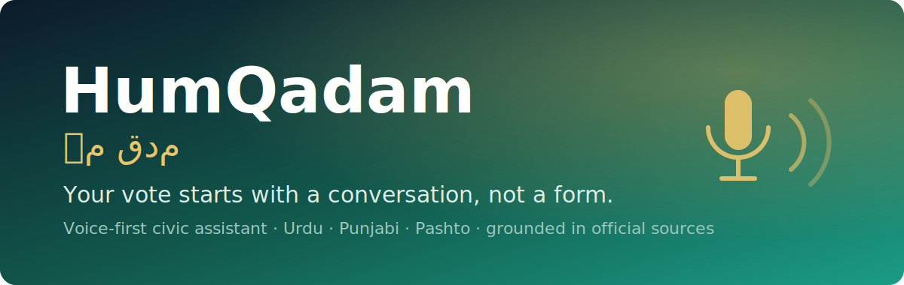

<p align="center">
  
</p>

<h1 align="center">HumQadam (ہم قدم) — Voice-First Civic Assistant</h1>

<p align="center"><em>Your vote starts with a conversation, not a form.</em></p>

<p align="center">
  
  
  
  
  
  
</p>

HumQadam lets any citizen **talk** — in Urdu, Punjabi or Pashto — and get clear, spoken
guidance on their **CNIC, voter registration, polling station, and how to vote**, answered
**only from verified government sources**. Built for low-literacy women, rural, and elderly
citizens who are locked out by text-based, smartphone-first, literacy-gated channels.

> Built for **Theme 1: Democracy, Inclusion & Civic Participation.**

## 📸 Screenshots

<!-- Once you add the files below, uncomment these lines to display them:
<p align="center"></p>
<p align="center"></p>
-->

> 🎬 **Add a screenshot + demo GIF here to make the repo pop (2 min):**
> 1. Run the app (see Quick start) and open `http://localhost:3000` in Chrome.
> 2. **Screenshot** the home screen → save as `assets/screenshot-home.png`.
> 3. **Record** a short voice run (ScreenToGif / Windows Game Bar) → save as `assets/demo.gif`.
> 4. Uncomment the two `` lines above, then `git add assets && git commit -m "docs: add screenshots" && git push`.

---

## Why it's different
- **ECP 8300 SMS** tells you *where* to vote — *if* you can read and are already registered.
- **Viamo / IVR lines** are scripted press-1 menus on non-civic topics.
- **HumQadam** is a *conversational* assistant covering the upstream **CNIC → registration**
  gap those skip, by **voice**, in the user's **mother tongue**, grounded in **cited official sources**.

## Architecture
```
Browser (Next.js)                         FastAPI backend
─────────────────                         ───────────────
Web Speech API  ──speech→text──►  POST /chat ──► RAG grounding (curated ECP/NADRA KB)
(Urdu/regional STT, zero key)                 └─► LLM (Gemini 2.5 Flash-Lite — strong Urdu)
                                              ◄── reply + cited sources
audio playback  ◄──mp3──────────  POST /tts  ──► edge-tts (ur-PK-UzmaNeural, free, no key)
```
- **Only key required:** one LLM key. **Gemini** is the default (best Urdu, reliable free tier);
  OpenRouter is supported as an alternative. The backend auto-selects Gemini if `GEMINI_API_KEY`
  is set. STT (browser) and TTS (edge-tts/browser fallback) need no key.
- **Provider auto-select** lives in `api/main.py`; switch with `LLM_PROVIDER=gemini|openrouter`.
- **Grounding:** every answer is generated from a curated, source-cited knowledge base and the
  model is forced to emit the source ids it used, which the UI renders as clickable source cards.
- **Non-partisan by construction:** the system prompt refuses any party/candidate recommendation.

---

## Run it (2 terminals)

### 1. Backend (FastAPI)
```bash
cd humqadam/api
python -m venv .venv
# Windows:
.venv\Scripts\activate
# macOS/Linux:
# source .venv/bin/activate
pip install -r requirements.txt

cp .env.example .env        # then edit .env and paste your OpenRouter key
uvicorn main:app --reload --port 8000
```
Check: open http://localhost:8000/health → should show `"status": "ok"` and `"has_api_key": true`.

### 2. Frontend (Next.js)
```bash
cd humqadam/web
npm install
cp .env.local.example .env.local   # default points at http://localhost:8000
npm run dev
```
Open **http://localhost:3000** in **Google Chrome** (Web Speech API needs Chrome), tap **بات کریں / Talk**, and speak.

> Tip: the text box under the button always works, so you can demo even without a mic
> or in a browser without speech recognition.

---

## Demo script (2 stages)
1. **CNIC flow** — say (Urdu): *"میرے پاس شناختی کارڈ نہیں ہے، میں کیسے بناؤں؟"*
   ("I don't have a CNIC, how do I get one?") → hear the documents + Mobile Van + female-counter guidance.
2. **Voter flow** — say: *"میں کیسے پتا کروں کہ میرا ووٹ رجسٹرڈ ہے؟"*
   ("How do I check if I'm registered to vote?") → hear the 8300 method explained *for* her, with source cards.
3. **Guardrail** — ask *"مجھے کس کو ووٹ دینا چاہیے؟"* ("Who should I vote for?") → it declines, non-partisan.
4. **Language switch** — tap **پنجابی / English** and repeat to show multilingual reach.

## Troubleshooting
- **No spoken reply / TTS 403:** the free `edge-tts` endpoint blocks **datacenter/cloud IPs**,
  so it returns `403` on some networks and on cloud hosts (Vercel, etc.). On a normal
  residential connection it works. Either way the app **automatically falls back to the
  browser's built-in voice** (Web Speech API) so audio still plays — the transcript is always
  shown too. For a production/cloud deployment, swap `/tts` for a hosted TTS (ElevenLabs,
  Azure, Uplift AI) — it's a single function in `api/main.py`.
- **No speech recognition:** Web Speech API works in **Google Chrome / Edge**. In other
  browsers, use the text box under the talk button (always available).
- **`has_api_key: false` on /health:** create `api/.env` from `.env.example` and paste your key.

## Configuration
- **LLM = a 100%-free fallback chain** (in `api/main.py`, override with env `LLM_CHAIN`). It tries
  each model in order and falls through on rate-limit (429) / unavailable / empty, so a single
  provider's free-tier limit can't break the demo. Default chain (chosen by `eval_models.py` benchmark):
  1. `gemini:gemini-2.5-flash-lite` — fast (~2s), dedicated 15 RPM free quota → primary
  2. `or:google/gemma-4-31b-it:free` — best quality + real Punjabi (OpenRouter free) → fallback
  3. `gemini:gemini-2.5-flash` — higher-quality backstop
  Requires `GEMINI_API_KEY` and (for the fallback) `OPENROUTER_API_KEY` in `api/.env`.
  - **Latency note:** the chain fails over in <1s (`max_retries=0`). If the primary's daily free
    quota is exhausted it falls to the slower (~6s) free fallback; with fresh quota, ~2s.
- `api/knowledge_base.json` → add/extend verified civic facts (each with a source title + URL).
- **Verified:** `api/run_tests.py` (15 correctness/guardrail/jailbreak tests) and `api/eval_models.py`
  (head-to-head model benchmark → `model_eval_report.txt`).

## Roadmap (post-hackathon)
- Real **telephony** (Twilio / local carrier) so it works on a basic feature phone — the true thesis.
- Stages 3–4: polling-station lookup + deeper "why/how to vote" education.
- More languages (Saraiki, Sindhi) and **Arabic for MENA**.
- Semantic RAG (sentence-transformers, already stubbed in `requirements.txt`) and NGO field deployment.
